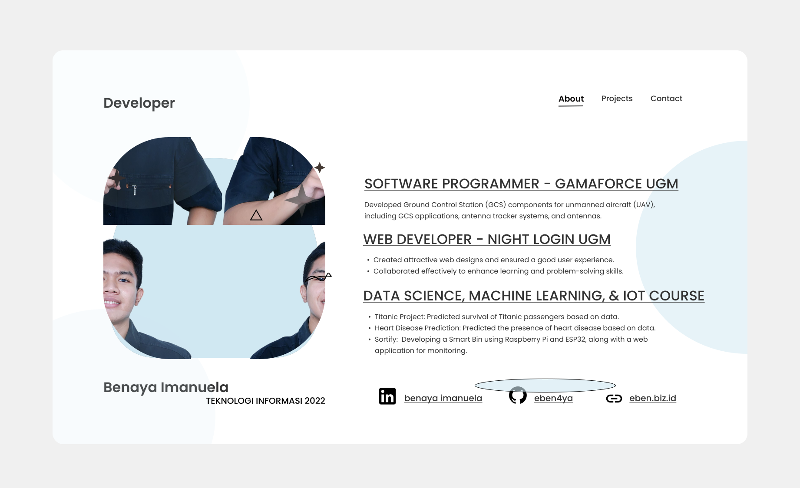
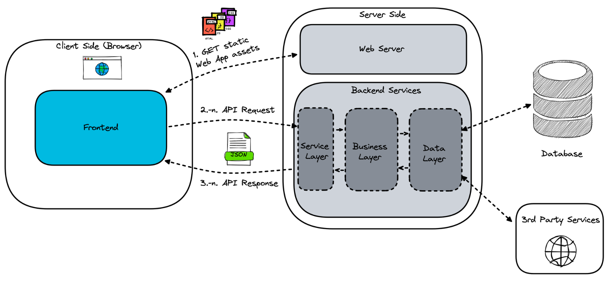
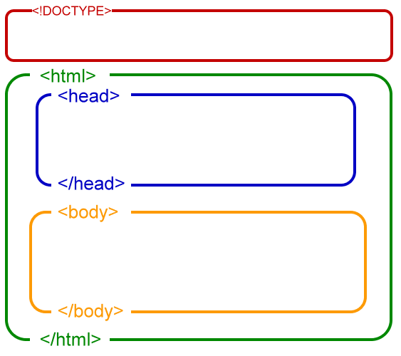
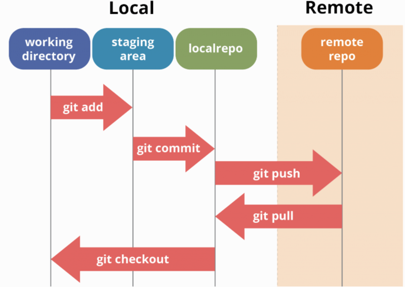

# 📌 Mentorship Web Development - Pertemuan 1

## 🎤 **Perkenalan Mentor**



## **Breakdown Kurikulum (AI-Powered Text Summarizer)**

| **Pertemuan** | **Topik**                                  | **Implementasi pada Proyek**                                                                       |
| ------------- | ------------------------------------------ | -------------------------------------------------------------------------------------------------- |
| **1**         | **Setup & Dasar Web Development**          | Setup Git, VS Code, repo GitHub, buat struktur dasar HTML & CSS                                    |
| **2**         | **Tailwind CSS & Responsive UI**           | Membangun UI aplikasi menggunakan framework CSS (Tailwind CSS)                                     |
| **3**         | **JavaScript & API Fetching**              | Belajar dasar javascript yang dipakai di React. Membuat input form & mengambil data dari API dummy |
| **4**         | **React Basics (Component, State, Props)** | Mengonversi proyek ke React, membuat komponen utama                                                |
| **5**         | **API Integration dengan AI**              | Menghubungkan aplikasi ke **AI API (OpenAI/Deepseek/Llama)** untuk menghasilkan ringkasan          |
| **6**         | **Deployment ke Vercel & Showcase**        | Deploy aplikasi ke **Vercel**, memoles UI, penjelasan proyek akhir                                 |

## 🏗️ Setup & Dasar Web Development

### 🎯 **Tujuan Pertemuan**

Pada pertemuan pertama ini, kita akan:

- Mengenal tools dan workflow dasar web development.
- Menyiapkan lingkungan pengembangan (Git, VS Code, GitHub).
- Memahami dasar HTML & CSS dengan struktur proyek sederhana.

---

## 1️⃣ **Pendahuluan**

### 💡 **Bagaimana Aplikasi Web Bekerja?**



Website bekerja dengan cara **client (browser) dan server berkomunikasi** melalui proses berikut:

1. **Browser Meminta Halaman Web**

   - Pengguna membuka website di browser.
   - Browser mengirim permintaan ke **web server** untuk mengambil file statis seperti HTML, CSS, dan JavaScript.

2. **Server Mengembalikan File Statis**

   - Web server mengirimkan file yang diminta kepada browser.
   - Browser kemudian merender halaman web berdasarkan file yang diterima.

3. **Frontend Berinteraksi dengan Backend Melalui API**

   - Jika halaman membutuhkan data dari server (misalnya data pengguna), frontend mengirimkan **API Request** ke backend dalam format JSON.

4. **Backend Memproses Permintaan**

   - **Service Layer** menangani permintaan dari frontend.
   - **Business Layer** menjalankan logika bisnis dan aturan aplikasi.
   - **Data Layer** berkomunikasi dengan **database** untuk membaca atau menyimpan data.

5. **Server Mengembalikan Data ke Frontend**

   - Setelah data diproses, server mengirimkan **API Response** dalam format JSON.
   - Frontend kemudian menampilkan data ini kepada pengguna.

6. **Interaksi dengan Layanan Eksternal (Opsional)**
   - Backend juga dapat berkomunikasi dengan **layanan pihak ketiga** seperti sistem pembayaran atau API eksternal.

---

## 2️⃣ **Setup Lingkungan Pengembangan**

### 🔹 **Install dan Konfigurasi Tools**

1. **Install Git**:
   - Windows: [Download Git](https://git-scm.com/download/win)
   - macOS: `brew install git`
   - Linux: `sudo apt install git` atau `sudo pacman -S git`
2. **Install VS Code**: [Download VS Code](https://code.visualstudio.com/)
3. **Buat akun GitHub**: [github.com](https://github.com/)
4. **Buat repositori GitHub baru**:
   - Buka GitHub → Buat repo baru → Copy link repo

### 🔹 **Clone Repo ke Local**

```sh
git clone <URL-REPO>
cd <NAMA-REPO>
```

### 🔹 **Konfigurasi Git**

```sh
git config --global user.name "example-user"
git config --global user.email "email@example.com"
```

---

## 3️⃣ **Menggunakan VS Code & Extension Pendukung**

### 🛠 **Install Extension yang Direkomendasikan (Install di Vs Code bagian ekstensi)**

1. **Prettier** - Otomatis merapikan kode untuk menjaga konsistensi dan keterbacaan.  
   🔗 [Unduh Prettier](https://marketplace.visualstudio.com/items?itemName=esbenp.prettier-vscode)

2. **Live Server** - Menjalankan proyek HTML secara real-time dengan fitur live-reload.
   🔗 [Unduh Live Server](https://marketplace.visualstudio.com/items?itemName=ritwickdey.LiveServer)

3. **HTML CSS Support** Menyediakan auto-complete dan bantuan untuk kode HTML dan CSS.  
   🔗 [Unduh HTML CSS Support](https://marketplace.visualstudio.com/items?itemName=ecmel.vscode-html-css)

4. **GitHub Copilot** (Opsional)- Asisten AI yang membantu dalam penulisan kode.  
   🔗 [Pelajari lebih lanjut tentang GitHub Copilot](https://github.com/features/copilot)

5. \_Auto Close Tag\_ - Secara otomatis menambahkan tag penutup saat Anda mengetik tag pembuka di file HTML.  
   🔗 [Unduh Auto Close Tag](https://marketplace.visualstudio.com/items?itemName=formulahendry.auto-close-tag)

6. \_Auto Rename Tag\_ - Secara otomatis mengganti nama pasangan tag HTML/XML saat Anda mengubah salah satunya, menjaga konsistensi dalam penamaantag.
   🔗 [Unduh Auto Rename Tag](https://marketplace.visualstudio.com/items?itemName=formulahendry.auto-rename-tag)

7. **Better Comment** - Meningkatkan kualitas komentar dalam kode dengan menambahkan anotasi berwarna untuk berbagai jenis komentar seperti TODO, peringatan, atau informasi peting.

8. **Color Highlight** - Menyoroti kode warna dalam file CSS atau HTML, memudahkan visualisasi dan pemilihan warna yang tepat.

---

## 4️⃣ **Membuat Struktur Dasar HTML & CSS**

### 📄 **Membuat File Dasar**

Di dalam folder proyek, buat file:

- `index.html`
- `style.css`

### 🏗️ **Struktur Dasar HTML**



Buka `index.html` dan tambahkan:

```html
<!DOCTYPE html>
<html lang="id">
  <head>
    <meta charset="UTF-8" />
    <meta name="viewport" content="width=device-width, initial-scale=1.0" />
    <title>AI Summarizer</title>
    <link rel="stylesheet" href="style.css" />
  </head>
  <body>
    <header>
      <h1>AI Summarizer</h1>
    </header>
    <main>
      <p>Masukkan teks untuk diringkas:</p>
      <textarea
        rows="5"
        cols="50"
        title="Input text area"
        placeholder="Masukkan teks di sini"
      ></textarea>
      <button>Ringkas</button>
    </main>
  </body>
</html>
```

🔎 **Penjelasan kode HTML:**

- `<!DOCTYPE html>` → Menentukan bahwa ini adalah dokumen HTML5.
- `<html lang="id">` → Menentukan bahasa utama halaman sebagai Bahasa Indonesia.
- `<head>`:
  - `<meta charset="UTF-8">` → Mengatur encoding karakter agar mendukung berbagai bahasa.
  - `<meta name="viewport" content="width=device-width, initial-scale=1.0">` → Membantu tampilan agar responsif di perangkat mobile.
  - `<title>AI Summarizer</title>` → Menentukan judul tab halaman.
  - `<link rel="stylesheet" href="style.css">` → Menghubungkan file CSS.
- `<body>`:
  - `<header>` → Bagian atas halaman dengan judul aplikasi.
  - `<main>` → Bagian utama halaman berisi input textarea dan tombol.

---

### 🎨 **Menambahkan CSS Sederhana**

Buka `style.css` dan tambahkan:

```css
/* Gaya dasar untuk seluruh halaman */
body {
  font-family: Arial, sans-serif;
  text-align: center;
  margin: 0;
  padding: 20px;
  background-color: #f4f4f4;
}

/* Header utama */
header {
  font-size: 24px;
  font-weight: bold;
  margin-bottom: 20px;
}

/* Gaya untuk textarea */
textarea {
  width: 80%;
  padding: 10px;
  margin: 10px 0;
  border: 1px solid #ccc;
  border-radius: 5px;
}

/* Gaya untuk tombol */
button {
  padding: 10px 20px;
  background-color: #007bff;
  color: white;
  border: none;
  cursor: pointer;
  border-radius: 5px;
  transition: 0.3s;
}

/* Efek hover pada tombol */
button:hover {
  background-color: #0056b3;
}
```

🔎 **Penjelasan kode CSS:**

- `body` → Mengatur tampilan dasar halaman, termasuk font dan warna latar belakang.
- `header` → Memberikan ukuran font lebih besar untuk judul aplikasi.
- `textarea` → Memperbesar input area agar lebih nyaman digunakan.
- `button` → Mendesain tombol agar menarik, dengan efek hover.

---

## 5️⃣ **Menggunakan Git untuk Version Control**

### 🛠 **Workflow Git**



1. **Menambahkan perubahan ke staging area**

   ```sh
   git add .

   - Memindahkan perubahan dari **working directory** ke **staging area**.

   ```

2. **Menyimpan perubahan ke local repository**

   ```sh
   git commit -m "Deskripsi perubahan"
   ```

   - Menyimpan perubahan secara permanen di repositori lokal.

3. **Mengirim perubahan ke repositori remote (GitHub)**
   ```sh
   git push origin main
   ```
   - Mengunggah perubahan dari repositori lokal ke **remote repository**.

---

## ✅ **Kesimpulan**

- Sudah mengenal workflow dasar web development.
- Sudah menyiapkan lingkungan pengembangan dengan **Git & VS Code**.
- Sudah menginstall **VS Code Extensions** yang membantu produktivitas.
- Sudah memahami dasar HTML & CSS dengan struktur proyek sederhana.
- Sudah memahami dasar penggunaan **Git & GitHub**.

## 📚 **Referensi Tambahan**

1. **Channel YouTube Programming with Mosh**  
   🔗 [Kunjungi Channel](https://youtu.be/qz0aGYrrlhU?si=WddGoK1gD2iXZ2lz)

2. **Dokumentasi Tambahan Git**  
   🔗 [Unduh Tutorial Git](https://s.id/SupplementsGitDocs)

🚀 **Pertemuan berikutnya** kita akan membahas **Tailwind CSS & Responsive UI!**
