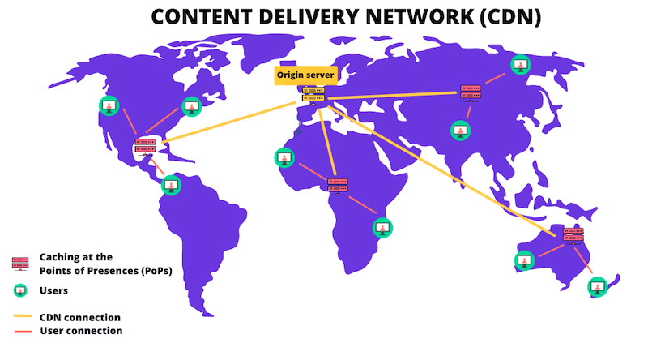

# 📌 Modul 2: Tailwind CSS & Responsive UI

## 🎯 Tujuan Pertemuan

Pada pertemuan kedua ini, kita akan:

- Mengenal Tailwind CSS dan cara penggunaannya untuk membangun UI responsif.
- Memahami konsep utility-first, cara kerja CDN Tailwind, serta kelebihan penggunaan Tailwind dibandingkan dengan CSS konvensional.
- Mengubah kode HTML & CSS dari modul pertama menggunakan Tailwind CSS.
- Menambahkan fitur tambahan seperti **Reset** dan **Riwayat Ringkasan** untuk melengkapi fitur AI Summarizer.

---

## Mengenal Tailwind CSS, CDN, dan Keunggulan Tailwind

### Utility-First CSS

**Tailwind CSS** memungkinkan penulisan styling langsung di HTML melalui kelas-kelas utilitas—mirip dengan inline CSS, tetapi dengan konsistensi dan struktur yang lebih baik. Contoh:

```html
<button
  class="px-6 py-2 bg-blue-600 text-white rounded hover:bg-blue-700 transition"
>
  Klik Saya
</button>
```

Setiap kelas seperti `px-6` atau `bg-blue-600` berfungsi seperti properti CSS yang ditulis langsung di atribut `style`, namun dengan standar yang konsisten.

#### Cara Pemanggilan CSS

1. **Inline CSS:**  
   Ditulis langsung di elemen.
   ```html
   <button
     style="padding: 1.5rem 0.5rem; background-color: #007bff; color: white; border-radius: 5px;"
   >
     Klik Saya
   </button>
   ```
2. **Internal CSS:**  
   Ditulis di dalam tag `<style>` di `<head>`.
   ```html
   <head>
     <style>
       .custom-btn {
         padding: 10px 20px;
         background: #007bff;
         color: white;
         border-radius: 5px;
       }
     </style>
   </head>
   ```
3. **Eksternal CSS:**  
   Ditulis di file `.css` terpisah yang di-link-kan ke HTML.
   ```html
   <head>
     <link rel="stylesheet" href="style.css" />
   </head>
   ```

### Cara Kerja CDN Tailwind CSS

Dengan menambahkan skrip CDN Tailwind pada tag `<head>`, browser akan mengunduh file CSS Tailwind dari server CDN.  
CDN (Content Delivery Network) merupakan jaringan server global yang menyimpan file statis, sehingga file Tailwind dapat diakses dengan cepat dari lokasi terdekat.



Ini mengurangi beban server Anda dan mempercepat waktu load halaman.

#### Ilustrasi Cara Kerja CDN dengan Mermaid

[](https://mermaid.live/edit#pako:eNpdkL9uwkAMh1_l5BleIEMlkgwsoKphai6DlXOSU-8PMneNEPDuGEI74MmWvs-2fhfooyEoYHBx7ifkpA61Dkpq05Yc5xNxp9brj-snsbchIQZ1QOtmG4yqmuaqyrYh_iVWVb3vFrV8GjsKo2Xrf0QZrKMF37y2PxBVtV8UjLhbdOiFM-K8XehgBV6OozXy5-Wha0gTedJQSGtowOySBh1ugmJOsTmHHorEmVbAMY8TFAO6k0z5aDBRbXFk9H_IEcN3jP4fImNT5N0SzDOf2x0_AmJQ)

### Kelebihan Tailwind CSS dengan Contoh Kodingan

1. **Produktivitas Tinggi**

   - **CSS Biasa:**  
     Membutuhkan penulisan properti satu per satu.
   - **Tailwind:**  
     Cukup dengan menambahkan kelas seperti `bg-blue-600` atau `rounded` langsung di HTML.

   ```html
   <!-- CSS Biasa -->
   <button class="custom-btn">Klik Saya</button>

   <!-- Tailwind CSS -->
   <button
     class="px-6 py-2 bg-blue-600 text-white rounded hover:bg-blue-700 transition"
   >
     Klik Saya
   </button>
   ```

2. **Konsistensi Desain**

   - **CSS Biasa:**  
     Perlu memastikan style yang sama diterapkan di banyak file atau komponen.
   - **Tailwind:**  
     Kelas utilitas standar memastikan konsistensi desain tanpa harus menulis ulang kode.

3. **Responsiveness yang Mudah**

   Tailwind menyediakan prefix seperti `sm:`, `md:`, dan `lg:` yang memungkinkan pengaturan desain responsif tanpa menulis media query secara manual.

   ```html
   <!-- Tombol responsif dengan Tailwind -->
   <button
     class="px-6 py-2 bg-blue-600 text-white rounded hover:bg-blue-700 transition sm:px-8"
   >
     Klik Saya
   </button>
   ```

4. **Pengurangan CSS Kustom**

   Banyak utilitas yang sudah tersedia sehingga mengurangi kebutuhan menulis kode CSS khusus. Hal ini meningkatkan maintainability dan menghindari konflik styling.

---

## 0️⃣ Review Basic HTML & CSS 😅

- 🔗 [PPT](https://www.canva.com/design/DAGhD690Vm4/qQoe9HD94nnDsr_ATcmKSQ/edit?utm_content=DAGhD690Vm4&utm_campaign=designshare&utm_medium=link2&utm_source=sharebutton)

## 1️⃣ Kode HTML dengan Tailwind CSS & Fitur Tambahan

Buka `index.html` dan ganti isinya dengan kode berikut:

```html
<!DOCTYPE html>
<html lang="id">
  <head>
    <meta charset="UTF-8" />
    <meta name="viewport" content="width=device-width, initial-scale=1.0" />
    <title>AI Summarizer</title>
    <!-- Global Styles -->
    <link rel="stylesheet" href="style.css" />
    <!-- Tailwind CSS via CDN -->
    <script src="https://cdn.tailwindcss.com"></script>
  </head>
  <body class="bg-gray-100 font-sans">
    <header class="bg-blue-500 text-white py-4">
      <h1 class="text-3xl font-bold">AI Summarizer</h1>
    </header>
    <main class="max-w-3xl mx-auto p-4">
      <p class="mb-4 text-lg">Masukkan teks untuk diringkas:</p>
      <!-- Container input dan tombol -->
      <div class="flex flex-col sm:flex-row gap-4">
        <textarea
          class="w-full p-3 border border-gray-300 rounded-lg focus:outline-none focus:ring-2 focus:ring-blue-500"
          rows="5"
          placeholder="Masukkan teks di sini"
        ></textarea>
        <div class="flex flex-col gap-2">
          <button
            class="px-6 py-2 bg-blue-600 text-white rounded hover:bg-blue-700 transition"
          >
            Ringkas
          </button>
          <button
            class="px-6 py-2 bg-red-500 text-white rounded hover:bg-red-600 transition"
          >
            Reset
          </button>
        </div>
      </div>
      <!-- Fitur Tambahan: Hasil Ringkasan -->
      <section class="mt-8 bg-white p-4 rounded shadow">
        <h2 class="text-xl font-semibold mb-2">Hasil Ringkasan</h2>
        <p class="text-gray-700">
          Hasil ringkasan teks akan muncul di sini setelah proses ringkasan
          selesai.
        </p>
      </section>
      <!-- Fitur Tambahan: Riwayat Ringkasan -->
      <section class="mt-8 bg-white p-4 rounded shadow">
        <h2 class="text-xl font-semibold mb-2">Riwayat Ringkasan</h2>
        <ul class="list-disc list-inside text-gray-700">
          <li>Ringkasan 1: Contoh ringkasan teks.</li>
          <li>Ringkasan 2: Contoh ringkasan teks lainnya.</li>
        </ul>
      </section>
    </main>
  </body>
</html>
```

---

## 2️⃣ Penjelasan Detail Setiap Kelas Tailwind yang Digunakan

- **`<body class="bg-gray-100 font-sans">`**

  - **`bg-gray-100`**: Mengatur background body dengan warna abu-abu sangat terang.
  - **`font-sans`**: Mengatur jenis font ke sans-serif untuk tampilan modern.

- **`<header class="bg-blue-500 text-white py-4">`**

  - **`bg-blue-500`**: Memberikan background biru dengan tingkat kecerahan standar.
  - **`text-white`**: Mengatur warna teks menjadi putih.
  - **`py-4`**: Menambahkan padding vertikal sebesar 1 rem.

- **`<h1 class="text-3xl font-bold">`**

  - **`text-3xl`**: Mengatur ukuran teks menjadi extra besar.
  - **`font-bold`**: Menebalkan teks agar lebih mencolok.

- **`<main class="max-w-3xl mx-auto p-4">`**

  - **`max-w-3xl`**: Membatasi lebar maksimum konten agar tidak terlalu lebar.
  - **`mx-auto`**: Memusatkan konten secara horizontal.
  - **`p-4`**: Menambahkan padding sebesar 1 rem di seluruh sisi.

- **`<p class="mb-4 text-lg">`**

  - **`mb-4`**: Menambahkan margin bawah sebesar 1 rem.
  - **`text-lg`**: Mengatur ukuran teks menjadi besar untuk keterbacaan.

- **`<div class="flex flex-col sm:flex-row gap-4">`**

  - **`flex`**: Mengubah container menjadi flexbox untuk layout responsif.
  - **`flex-col`**: Menyusun elemen secara vertikal.
  - **`sm:flex-row`**: Pada layar kecil ke atas, menyusun elemen secara horizontal.
  - **`gap-4`**: Menambahkan jarak antar elemen sebesar 1 rem.

- **`<textarea class="w-full p-3 border border-gray-300 rounded-lg focus:outline-none focus:ring-2 focus:ring-blue-500">`**

  - **`w-full`**: Lebar textarea 100% dari container.
  - **`p-3`**: Padding sebesar 0.75 rem.
  - **`border border-gray-300`**: Menambahkan border berwarna abu-abu terang.
  - **`rounded-lg`**: Membuat sudut textarea menjadi membulat.
  - **`focus:outline-none`**: Menghilangkan outline default saat difokuskan.
  - **`focus:ring-2 focus:ring-blue-500`**: Menambahkan efek ring berwarna biru saat difokuskan.

- **`<button class="px-6 py-2 bg-blue-600 text-white rounded hover:bg-blue-700 transition">`** (Tombol **Ringkas**)

  - **`px-6`**: Padding horizontal 1.5 rem.
  - **`py-2`**: Padding vertikal 0.5 rem.
  - **`bg-blue-600`**: Background biru intensitas 600.
  - **`text-white`**: Warna teks putih.
  - **`rounded`**: Sudut tombol membulat.
  - **`hover:bg-blue-700`**: Background berubah ke biru lebih gelap saat hover.
  - **`transition`**: Efek transisi yang halus.

- **`<button class="px-6 py-2 bg-red-500 text-white rounded hover:bg-red-600 transition">`** (Tombol **Reset**)

  - **`bg-red-500`**: Background merah intensitas 500.
  - **`hover:bg-red-600`**: Background berubah ke merah lebih gelap saat hover.
  - Kelas lainnya sama seperti tombol **Ringkas**.

- **`<section class="mt-8 bg-white p-4 rounded shadow">`** (Bagian **Hasil Ringkasan** & **Riwayat Ringkasan**)

  - **`mt-8`**: Margin atas 2 rem.
  - **`bg-white`**: Background putih.
  - **`p-4`**: Padding 1 rem.
  - **`rounded`**: Sudut membulat.
  - **`shadow`**: Menambahkan bayangan halus untuk efek depth.

- **`<h2 class="text-xl font-semibold mb-2">`**

  - **`text-xl`**: Ukuran teks extra large.
  - **`font-semibold`**: Ketebalan teks semi-bold.
  - **`mb-2`**: Margin bawah 0.5 rem.

- **`<p class="text-gray-700">`** dan **`<ul class="list-disc list-inside text-gray-700">`**
  - **`text-gray-700`**: Warna teks abu-abu gelap.
  - **`list-disc`**: Bullet list dengan simbol disc.
  - **`list-inside`**: Bullet berada di dalam area konten.

---

## 3️⃣ Global Styles di style.css

File `style.css` digunakan untuk:

- Melakukan reset global CSS.
- Menambahkan custom style tambahan yang tidak disediakan oleh Tailwind.

**Contoh isi `style.css`:**

```css
/* style.css */
/* Reset global */
* {
  margin: 0;
  padding: 0;
  box-sizing: border-box;
}

/* Custom global style tambahan */
body {
  line-height: 1.6;
}
```

---

## 📚 **Referensi Tambahan**

1. **Tailwind CSS Docs**  
   🔗 [Docs](https://tailwindcss.com/docs/styling-with-utility-classes)

## 🚀 Pertemuan Berikutnya

Pada pertemuan berikutnya, kita akan membahas **JavaScript & API Fetching** untuk mengintegrasikan fungsionalitas dinamis ke dalam aplikasi AI Summarizer.
