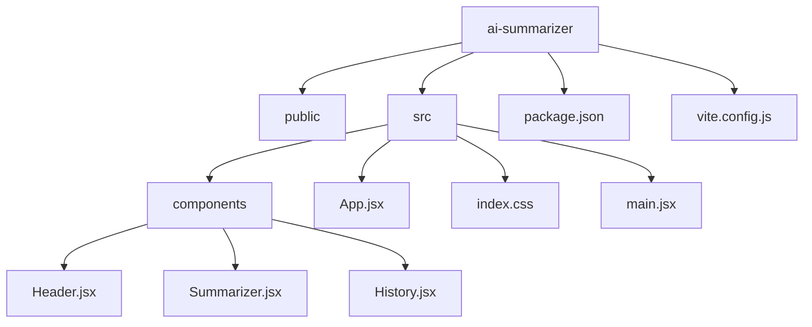

# 📌 Modul 4: React Basic dengan Vite

## 🎯 Tujuan Pertemuan

Pada pertemuan ke-4 ini, peserta akan:

- Menjelaskan keunggulan React JS yang di-setup dengan Vite, serta kelebihan Vite yang lebih ringan dan cepat.
- Memahami konsep Virtual DOM, komponen, state (useState, useEffect), dan props di React.
- Mengubah kode AI Summarizer yang sebelumnya berbasis HTML/Tailwind/JS menjadi aplikasi React yang modular.
- Mengenal struktur folder proyek React yang dibangun dengan Vite.

## Pengenalan React JS

**React JS** adalah library JavaScript yang dikembangkan oleh Facebook untuk membangun antarmuka pengguna (UI) yang interaktif dan reusable. Beberapa keunggulan React JS adalah:

- **Komponen Reusable:**  
  Setiap bagian UI dibagi menjadi komponen-komponen kecil yang dapat digunakan kembali, memudahkan pemeliharaan dan pengembangan.

- **Virtual DOM:**  
  React menggunakan Virtual DOM untuk mengoptimalkan pembaruan UI. Saat state berubah, React melakukan perbandingan antara Virtual DOM dan DOM nyata, kemudian hanya mengupdate bagian yang berubah, sehingga meningkatkan performa.
  
  

- **Ekosistem yang Luas:**  
  Dengan dukungan dari komunitas besar, React memiliki banyak library pendukung dan dokumentasi yang lengkap.

---

## React JS dengan Vite

### Mengapa Vite?

- **Performa Cepat:** Vite menggunakan ES modules dan bundler yang sangat cepat, sehingga proses build dan hot-reloading lebih cepat dibandingkan alat build tradisional.
- **Ringan & Modern:** Konfigurasi minimal dan mendukung fitur terbaru ES6+ serta integrasi yang mudah dengan React.
- **Pengalaman Pengembang yang Lebih Baik:** Dengan hot module replacement (HMR), perubahan kode langsung terlihat tanpa harus reload seluruh halaman.

---

## Instalasi React dengan Vite

**Vite** adalah alat build modern yang memungkinkan pengembangan React dengan kecepatan tinggi. Berikut adalah langkah-langkah untuk menginstal React menggunakan Vite:

1. **Pastikan Node.js dan npm sudah terinstal** (lihat Modul 3 untuk petunjuk instalasi).
2. **Buka terminal** dan jalankan perintah berikut untuk membuat proyek React baru menggunakan Vite:
   ```bash
   npm create vite@latest ai-summarizer -- --template react
   ```
   atau dengan Yarn:
   ```bash
   yarn create vite ai-summarizer --template react
   ```
3. **Masuk ke folder proyek:**
   ```bash
   cd ai-summarizer
   ```
4. **Instal dependensi:**
   ```bash
   npm install
   ```
   atau
   ```bash
   yarn
   ```
5. **Jalankan server pengembangan:**
   ```bash
   npm run dev
   ```
   atau
   ```bash
   yarn dev
   ```
   Vite akan memulai server pengembangan dan memberikan URL (biasanya `http://localhost:5173`) untuk melihat aplikasi React.

---

## Konsep Dasar React

- **Komponen:**  
  Komponen adalah blok bangunan utama di React. Setiap komponen dapat memiliki state dan props serta dapat digunakan kembali.

- **State:**  
  Menggunakan hook seperti `useState` untuk mengelola data lokal dalam komponen.
  ```javascript
  const [text, setText] = useState("");
  ```
- **Effect (useEffect):**  
  Hook untuk menangani efek samping seperti fetch data, atau mengupdate DOM setelah render.
  ```javascript
  useEffect(() => {
    // kode yang dijalankan setelah render
  }, []);
  ```
- **Props:**  
  Properti yang diteruskan dari komponen induk ke komponen anak untuk mengkomunikasikan data.

---

## Contoh Implementasi: AI Summarizer dengan React dan Vite

Kita akan memecah aplikasi AI Summarizer menjadi beberapa komponen:

- **Header:** Menampilkan judul aplikasi.
- **Summarizer:** Menangani input teks, tombol Ringkas & Reset, dan menampilkan hasil ringkasan.
- **History:** Menampilkan riwayat ringkasan dengan opsi delete.

### Struktur Folder Proyek

Berikut adalah contoh struktur folder yang digunakan dalam proyek React dengan Vite:

```plaintext
ai-summarizer/
├── node_modules/
├── public/
├── src/
│   ├── components/
│   │   ├── Header.jsx
│   │   ├── Summarizer.jsx
│   │   └── History.jsx
│   ├── App.jsx
│   ├── index.css
│   └── main.jsx
├── index.html
├── package.json
└── vite.config.js
```

_Visualisasi menggunakan Mermaid:_



---

## Ekstensi JSX

Ekstensi `.jsx` digunakan di React untuk menuliskan sintaks JavaScript yang mendukung HTML secara langsung, memudahkan developer menulis komponen UI yang deklaratif.

---

## Ekstensi Penting di VS Code

Instal ekstensi berikut untuk produktivitas lebih tinggi:

- **ES7+ React/Redux/React-Native snippets by dsznajder**:
  - Snippet singkat dan lengkap untuk mempercepat penulisan kode React.
  - [Link Instalasi](https://marketplace.visualstudio.com/items?itemName=dsznajder.es7-react-js-snippets)

---

## Instalasi Tailwind CSS Versi Terbaru

### **1️⃣ Instalasi Tailwind CSS**

Jalankan perintah berikut di terminal dalam direktori proyek React yang sudah dibuat dengan Vite:

```bash
npm install tailwindcss @tailwindcss/vite
```

---

### **2️⃣ Konfigurasi Plugin Vite**

Tambahkan plugin `@tailwindcss/vite` ke dalam file `vite.config.js` agar Vite dapat memproses Tailwind CSS dengan optimal.

Buka file `vite.config.js` dan tambahkan konfigurasi berikut:

```javascript
import { defineConfig } from "vite";
import react from "@vitejs/plugin-react";
import tailwindcss from "@tailwindcss/vite";

export default defineConfig({
  plugins: [react(), tailwindcss()],
});
```

---

### **3️⃣ Import Tailwind CSS**

Tambahkan direktif `@import` ke dalam file CSS utama (`src/index.css`) untuk mengaktifkan fitur Tailwind:

```css
@import "tailwindcss";
```

---

## Slicing Kode html css js vanilla ke React

#### File: `src/App.jsx`

```jsx
import { useState, useEffect } from "react";
import Header from "./components/Header";
import Summarizer from "./components/Summarizer";
import History from "./components/History";

const App = () => {
  const [inputText, setInputText] = useState("");
  const [summary, setSummary] = useState("");
  const [history, setHistory] = useState([]);

  // Ambil riwayat dari localStorage saat komponen pertama kali dimuat
  useEffect(() => {
    const storedHistory =
      JSON.parse(localStorage.getItem("summaryHistory")) || [];
    setHistory(storedHistory);
  }, []);

  const handleSummarize = () => {
    if (inputText.trim() === "") return;
    // Simulasi ringkasan: output sama dengan input
    setSummary(inputText);
    const newHistory = [...history, inputText];
    setHistory(newHistory);
    localStorage.setItem("summaryHistory", JSON.stringify(newHistory));
  };

  const handleReset = () => {
    setInputText("");
    setSummary("");
  };

  const handleDelete = (index) => {
    const newHistory = history.filter((_, i) => i !== index);
    setHistory(newHistory);
    localStorage.setItem("summaryHistory", JSON.stringify(newHistory));
  };

  return (
    <div className="bg-gray-100 font-sans min-h-screen">
      <Header title="AI Summarizer" />
      <main className="max-w-3xl mx-auto p-4">
        <Summarizer
          inputText={inputText}
          setInputText={setInputText}
          summary={summary}
          handleSummarize={handleSummarize}
          handleReset={handleReset}
        />
        <History history={history} handleDelete={handleDelete} />
      </main>
    </div>
  );
};

export default App;
```

#### File: `src/components/Header.jsx`

```jsx
const Header = ({ title }) => {
  return (
    <header className="bg-blue-500 text-white py-4">
      <h1 className="text-3xl font-bold">{title}</h1>
    </header>
  );
};

export default Header;
```

#### File: `src/components/Summarizer.jsx`

```jsx
const Summarizer = ({
  inputText,
  setInputText,
  summary,
  handleSummarize,
  handleReset,
}) => {
  return (
    <>
      <p className="mb-4 text-lg">Masukkan teks untuk diringkas:</p>
      <div className="flex flex-col sm:flex-row gap-4">
        <textarea
          value={inputText}
          onChange={(e) => setInputText(e.target.value)}
          className="w-full p-3 border border-gray-300 rounded-lg focus:outline-none focus:ring-2 focus:ring-blue-500"
          rows="5"
          placeholder="Masukkan teks di sini"
        ></textarea>
        <div className="flex flex-col gap-2">
          <button
            onClick={handleSummarize}
            className="px-6 py-2 bg-blue-600 text-white rounded hover:bg-blue-700 transition"
          >
            Ringkas
          </button>
          <button
            onClick={handleReset}
            className="px-6 py-2 bg-red-500 text-white rounded hover:bg-red-600 transition"
          >
            Reset
          </button>
        </div>
      </div>
      <section className="mt-8 bg-white p-4 rounded shadow">
        <h2 className="text-xl font-semibold mb-2">Hasil Ringkasan</h2>
        <p className="text-gray-700">
          {summary ||
            "Hasil ringkasan teks akan muncul di sini setelah proses ringkasan selesai."}
        </p>
      </section>
    </>
  );
};

export default Summarizer;
```

#### File: `src/components/History.jsx`

```jsx
const History = ({ history, handleDelete }) => {
  return (
    <section className="mt-8 bg-white p-4 rounded shadow">
      <h2 className="text-xl font-semibold mb-2">Riwayat Ringkasan</h2>
      {history.length === 0 ? (
        <p className="text-gray-700">Tidak ada riwayat ringkasan.</p>
      ) : (
        <ul className="list-disc list-inside text-gray-700 flex flex-col gap-2">
          {history.map((item, index) => (
            <li key={index} className="flex justify-between items-center">
              <span>{item}</span>
              <button
                onClick={() => handleDelete(index)}
                className="ml-4 px-2 py-1 bg-red-400 text-white rounded hover:bg-red-500 transition"
              >
                Delete
              </button>
            </li>
          ))}
        </ul>
      )}
    </section>
  );
};

export default History;
```

#### File: `src/main.jsx`

```jsx
import React from "react";
import ReactDOM from "react-dom/client";
import App from "./App";
import "./index.css";

ReactDOM.createRoot(document.getElementById("root")).render(
  <React.StrictMode>
    <App />
  </React.StrictMode>
);
```

---

## Penjelasan Kode React

- **Komponen:**  
  Aplikasi dipecah menjadi komponen-komponen kecil seperti Header, Summarizer, dan History.  
  Setiap komponen menerima data melalui props dan mengelola state menggunakan hook seperti `useState`.

- **State Management:**

  - **useState:** Digunakan untuk menyimpan nilai input, hasil ringkasan, dan riwayat ringkasan.
  - **useEffect:** Digunakan untuk mengambil data dari local storage ketika aplikasi pertama kali dimuat.

- **Props:**  
  Props digunakan untuk meneruskan data dan fungsi dari komponen induk (App) ke komponen anak (Header, Summarizer, History).

---

## Referensi Video Belajar React

- [React Full Course](https://youtu.be/CgkZ7MvWUAA?si=zp_FuXM-UhrVdpbi)

---

## Kesimpulan Modul 4

- Peserta telah mengenal React JS yang di-setup dengan Vite dan memahami keunggulan Vite.
- Konsep Virtual DOM, komponen, state (useState, useEffect), dan props telah dijelaskan.
- Aplikasi AI Summarizer telah diubah menjadi aplikasi React yang modular.
- Struktur folder proyek React dijelaskan untuk memudahkan pemahaman dan pengembangan selanjutnya.

🚀 **Selanjutnya**, kita akan memperdalam pengembangan komponen React dan mengintegrasikan API AI untuk memproses ringkasan secara otomatis!
